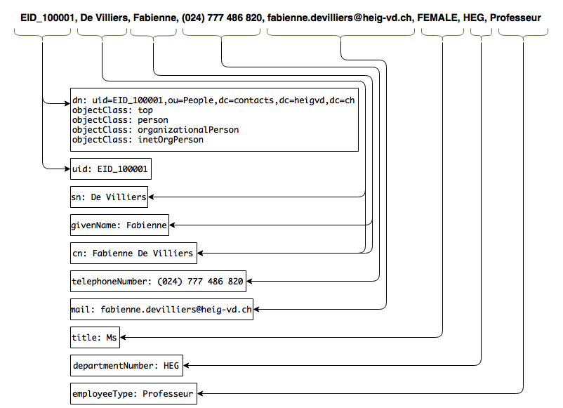

# Report for Lab 6: LDAP

## Table of Contents
1. [Introduction](#Intro)
1. [DIT Structure](#Struct)
1. [Mapping the CSV to DIT](#Map)
1. [Importing data](#Import)
1. [LDAP filter commands](#Filter)
1. [Dynamic group commands](#Group)
1. [Conclusion](#End)

#  Introduction

#  DIT Structure

#  Mapping the CSV to DIT

#  Importing data

1. If the CSV file has not yet been generated, do so. We will be referring to it as `users.csv`
1. While in the `LdapDataGenerator` folder, run the command `python LDAPParser.py users.csv users.ldif`. The file `users.ldif` will be generated in the current directory. This LDIF file contains everything to set up our directory from scratch, and we only need to import it in OpenDJ now.
1. To import, use the command `sudo /opt/opendj/bin/import-ldif -h localhost -p 4444 -b dc=heigvd,dc=ch -l /vagrant/users.ldif -R /vagrant/rejected.ldif --skipFile /vagrant/skipped.ldif`

The `LDAPParser.py` script simply creates all the domains and organisational units for the directory, then parses through the CSV file to write each entry for the new users. Once done, it creates all the departments as dynamic groups according to which department names were read in the CSV entries.

#  LDAP filter commands

* What is the **number** (not the list!) of people stored in the directory?  
`./ldapsearch -p 389 -b "dc=heigvd, dc=ch" "ou=People" numsubordinates`

* What is the **number** of departments stored in the directory?  
`./ldapsearch -p 389 -b "dc=heigvd, dc=ch" "ou=Department" numsubordinates`

* What is the **list** of people who belong to the TIC Department?  
`./ldapsearch -p 389 -b "dc=heigvd,dc=ch" "departmentNumber=TIC" cn`

* What is the **list** of students in the directory?  
`./ldapsearch -p 389 -b "dc=heigvd,dc=ch" "employeeType=Etudiant" cn`

* What is the **list** of students in the TIC Department?  
`./ldapsearch -p 389 -b "dc=heigvd,dc=ch" "(&(employeeType=Etudiant)(departmentNumber=TIC))" cn`

#  Dynamic groupd commands
* What command do you run to **define a dynamic group** that represents all members of the TIN Department?  
`Department?`  
`dn: cn=ExTIN,ou=Groups,dc=heigvd,dc=ch`  
`cn: ExTIN`  
`objectClass: top`  
`objectClass: groupOfURLs`  
`ou: Groups`  
`memberURL: ldap:///ou=People,dc=heigvd,dc=ch??sub?departmentNumber=TIN`

* What command do you run to **get the list of all members of the TIN Department**?  
`./ldapsearch -p 389 -b "dc=contacts,dc=heigvd,dc=ch" "isMemberOf=cn=ExTIN" cn`

* What command do you run to **define a dynamic group** that represents all students with a last name starting with the letter 'A'?  
`name starting with the letter 'A'?`  
`dn: cn=StdA,ou=Groups,dc=heigvd,dc=ch`  
`cn: StdA`  
`objectClass: top`  
`objectClass: groupOfURLs`  
`ou: Groups`  
`memberURL: ldap:///ou=People,dc=contacts,dc=heigvd,dc=ch??sub?(&(sn=A*)(employeeType=Etudiant))`

* What command do you run to **get the list** of these students?  
`./ldapsearch -p 389 -b "dc=heigvd,dc=ch" "isMemberOf=cn=StdA" cn`

#  Conclusion

